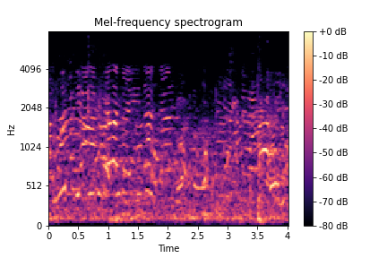
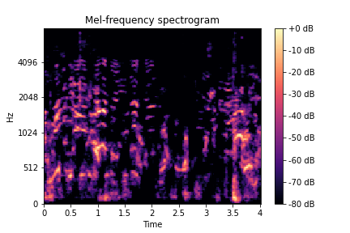

# CNN Urban Sound Classification

> This repository contains Deep Learning Bootcamp Project done by the group Skynet-0.1

Bu depo Global AI Hub & Koç Holding Derin Öğrenme Bootcamp'inde Skynet-0.1 grubunun projesini içerir

## Gürültüden Arındırılmış Spectogramlar

Spectogramlar oluşturulurken `noisereduce` kütüphanesi ile gürültüden arındırılıp alternatif spectogramlar elde edilmiştir.

Örnek:

| Orijinal                                                    | Gürültüsüz                                                      |
| :-:                                                         | :-:                                                             |
|  |  |

## Ön İşleme

+ Elde edilen spectogramlardan beyaz padding çıkarıldı.
+ Grayscale, resize ve normalizasyon yapıldı.
+ [np.array, etiket] listeleri halinde csv dosyalarına yazıldı.
